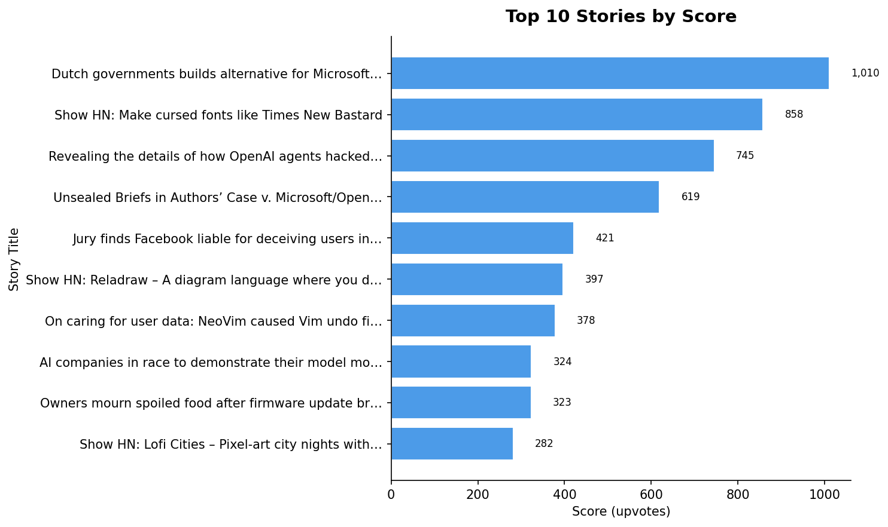
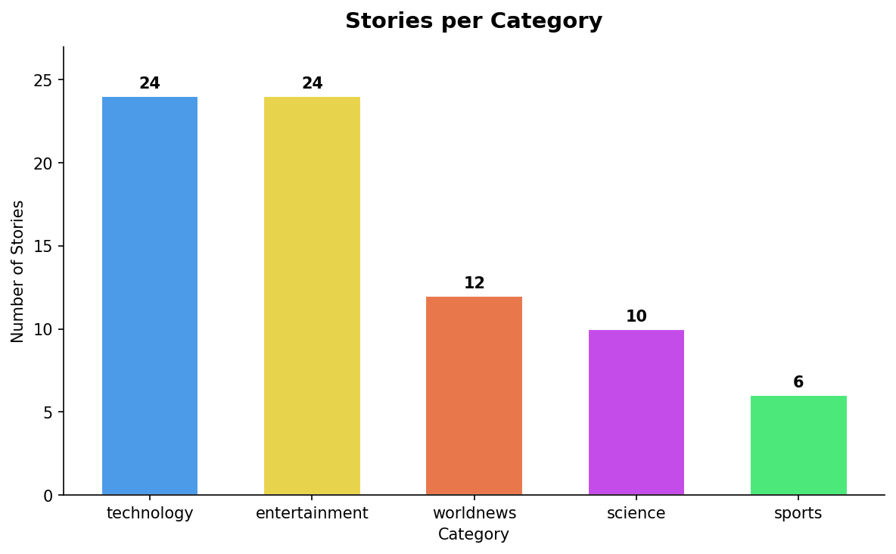
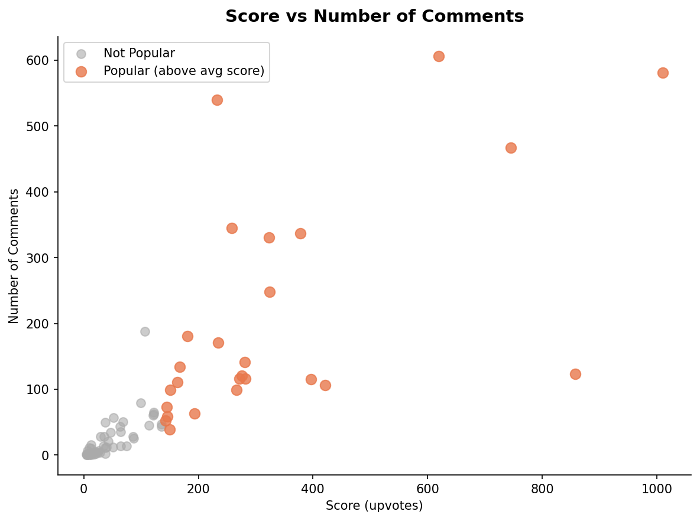
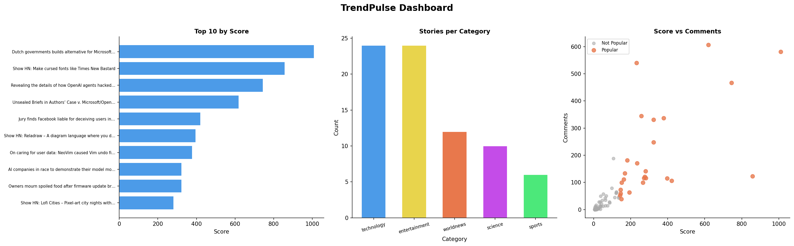

# TrendPulse 📊
> An end-to-end data analysis pipeline that fetches trending stories from Hacker News, cleans and analyses them, and produces visual dashboards.

    

---

## 📌 Project Overview

TrendPulse is a mini data analytics project built as part of the **AI/ML course at IIT Patna via Masai School**.

It covers the full data workflow:

```
Data Collection → Data Cleaning → Analysis → Visualization
```

- **Source:** Hacker News public API
- **Stories fetched:** 500 → cleaned to 76 quality stories
- **Categories:** Technology, World News, Sports, Science, Entertainment

---

## 🗂️ Pipeline Structure

| Task | File | Description |
|------|------|-------------|
| Task 1 | `task1_collect.py` | Fetch story IDs & details from Hacker News API |
| Task 2 | `task2_clean.py` | Clean raw JSON → tidy CSV |
| Task 3 | `task3_analyse.py` | EDA, NumPy stats, new feature columns |
| Task 4 | `task4_visualise.py` | Generate charts & dashboard PNGs |

---

## 📊 Key Findings

- **76 quality stories** after filtering (score ≥ 5)
- **Mean score:** 143 | **Max score:** 1,010 | **Std deviation:** 192
- **Most discussed story:** 606 comments — *"Unsealed Briefs in Authors' Case v. Microsoft/OpenAI"*
- **Top story:** *"Dutch government builds alternative for Microsoft"* — 1,010 upvotes
- **Dominant category:** Technology (24 stories) & Entertainment (24 stories)

---

## 📈 Visualizations

### Top 10 Stories by Score


### Stories by Category


### Score vs Comments (Scatter)


### TrendPulse Dashboard


---

## 🛠️ Tech Stack

| Tool | Purpose |
|------|---------|
| Python 3.x | Core language |
| Pandas | Data cleaning & analysis |
| NumPy | Statistical computations |
| Matplotlib | Charts & dashboard |
| Hacker News API | Data source |
| Google Colab | Development environment |
| Git & GitHub | Version control |

---

## 🚀 How to Run

### 1. Clone the repo
```bash
git clone https://github.com/reuke1111/trendpulse-dinesshrajh.git
cd trendpulse-dinesshrajh
```

### 2. Install dependencies
```bash
pip install pandas numpy matplotlib requests
```

### 3. Run the pipeline in order
```bash
python task1_collect.py    # Fetches data from API → saves data/trends_YYYYMMDD.json
python task2_clean.py      # Cleans JSON → saves data/trends_clean.csv
python task3_analyse.py    # Analyses data → saves data/trends_analysed.csv
python task4_visualise.py  # Generates charts → saves outputs/*.png
```

Or open `Untitled0.ipynb` directly in **Google Colab** and run all cells.

---

## 📁 Folder Structure

```
trendpulse-dinesshrajh/
│
├── data/
│   ├── trends_YYYYMMDD.json      # Raw API data
│   ├── trends_clean.csv          # Cleaned data
│   └── trends_analysed.csv       # Analysed data with new columns
│
├── outputs/
│   ├── chart1_top_stories.png
│   ├── chart2_categories.png
│   ├── chart3_scatter.png
│   └── dashboard.png
│
├── Untitled0.ipynb               # Full Colab notebook
└── README.md
```

---

## 👤 Author

**Dinesshrajh V (Reuke)**
- 🔗 [LinkedIn](https://www.linkedin.com/in/dinesshrajh-v-dinesshrajh/)
- 💻 [GitHub](https://github.com/reuke1111)
- 📍 Trichy, Tamil Nadu

---

## 🎓 Course

Built as part of the **AI/ML Mini Project** — IIT Patna × Masai School

---

*If you found this useful, drop a ⭐ on the repo!*
